# Jim's CRT Shaders

A collection of modular filters for Pixi.js, targeted at pixi v8+, written in GLSL. Each one is designed to do one very small job well, and to be composed with other shaders. Use all of them, or some of them. Don't like one? drop and replace it. Mix them with other filters as you wish. Tree shakes fine.

Originally created for my open source, web-based remake of the classic [Head over Heels](https://en.wikipedia.org/wiki/Head_over_Heels_(video_game)) at [blockstack.ing](https://blockstack.ing) - [github repo here](https://github.com/jimhigson/head-over-heels-online).

<div align="center">
  <table>
    <tr>
      <td align="center" style="font-size: 20px;">      
        <a href="https://jimhigson.github.io/jims_shaders/" style="font-size: 20px;"><strong>Storybook - Try different settings in the live shader Demo 📺🔴🟢🔵</strong>
        <br />
        <br />
        </a>        
      </td>
    </tr>    
  </table>
</div>

<div align="center">
  <table>    
    <tr>
      <td align="center" style="font-size: 20px;">
        <a href="https://blockstack.ing" style="font-size: 20px; display: flex; flex-direction: column; align-items: center;">
          <strong>🎮 Or, see it in action in my Head Over Heels remake 🕹️</strong>
          <br />
          <br />
          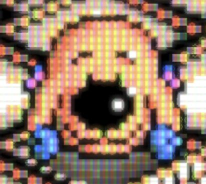
        </a>
      </td>
    </tr>
  </table>
</div>

## Installing

Install `@blockstacking/jims-shaders` from npm with npm/yarn/pnpm/whatever.

## Why?

In short to make my [head over heels remake a bit less pixel-y](https://blockstack.ing) in a realistic way.

I found most other filters made the screen too dark. Scanline filters would add dark bars into the image 'between' pixels, but not lighten the brighter area to compensate, making an overall darker screen. Phosphor mask filters similarly darkened the screen.

I also wanted to pick-and-mix to get the best of various different filters, not forced to take all-or-nothing from one.

In the sample below (from [Test card F](https://en.wikipedia.org/wiki/Test_Card_F)), you see scanlines and phosphor slot mask being added, but:

* white stays at maximum luminosity
* all other colours stay about the same (overall)

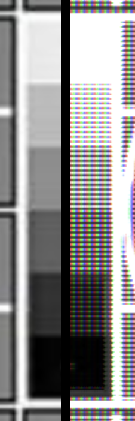

### Scanlines

Here's Sonic with just scanlines applied:

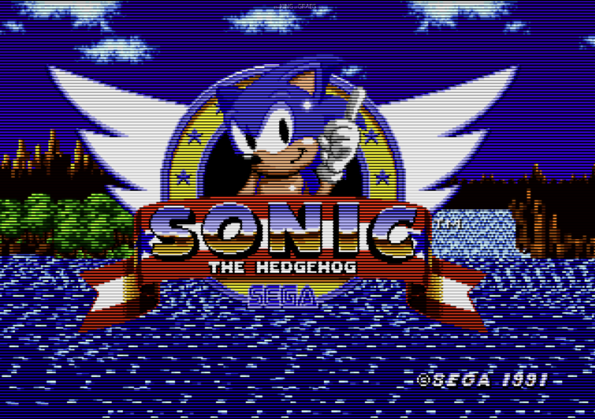

To keep the brightness roughly the same I modulate the *thickness* of the dark section. You can see this in this close up:


Note that on the white sections the scanlines are almost entirely eliminated, but in the dark red they cover almost all of the pixel

### Phosphor Mask

I only emulate a slotmask phosphor mask (no option for trinitron/green-magenta) - but the shaders are modular this could be swapped out. This was the most common tv for home and arcades in the 80s and 90s, and looked like this:

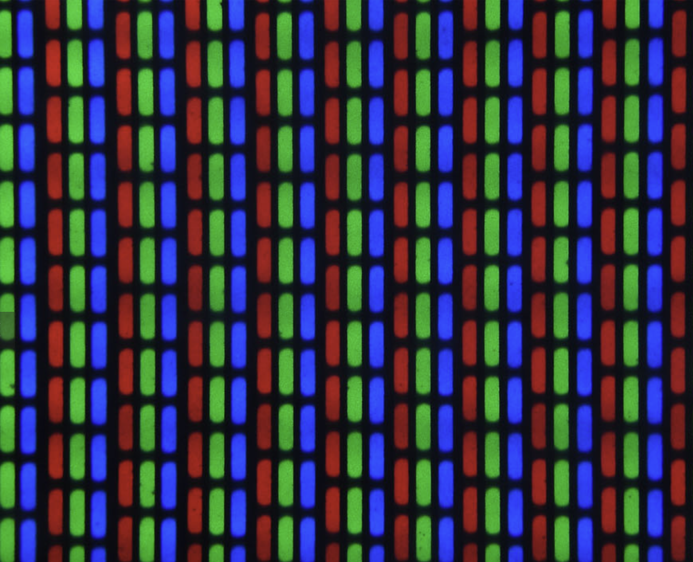

Since I try to keep the overall intensity the same, for the luminance this takes away, I try to boost the primary channel (first) and the other two channels (secondarily) to bring the overall brightness back up.

Here's how it looks with moderate settings:

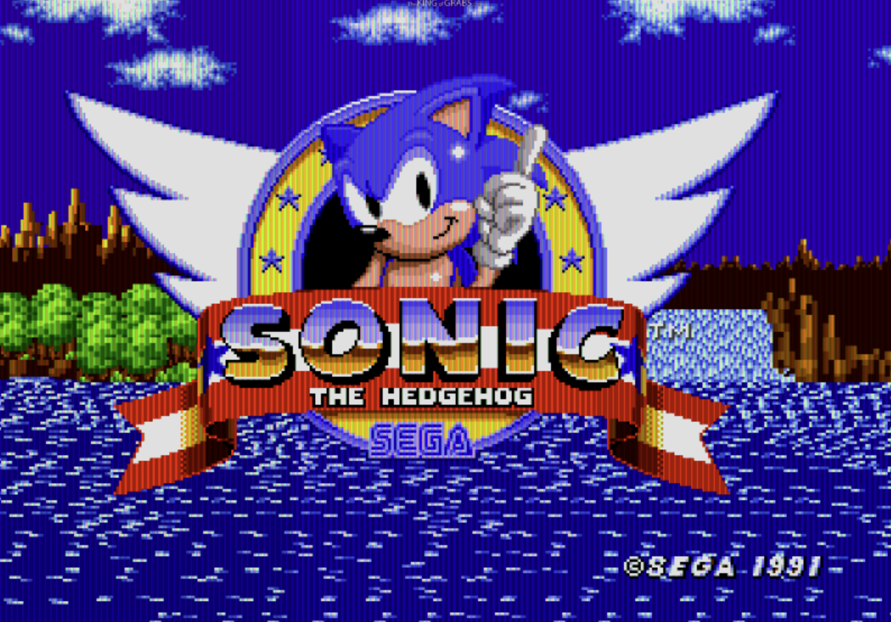

Up close this is how it looks:

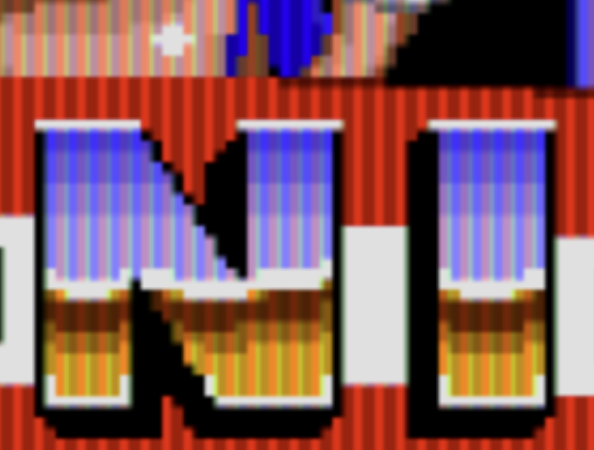

And with more extreme settings (mask brightness set to zero) it starts to fully resemble the mask - note that will the screen is made only out of RGB pixels now.

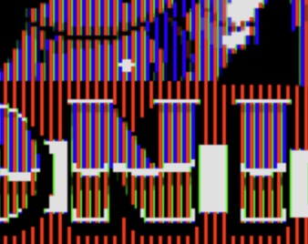

By experimenting with slightly misaligned phosphor mask (like 1.03% of the upscaled pixel size) it's possible to create
some interesting effects:

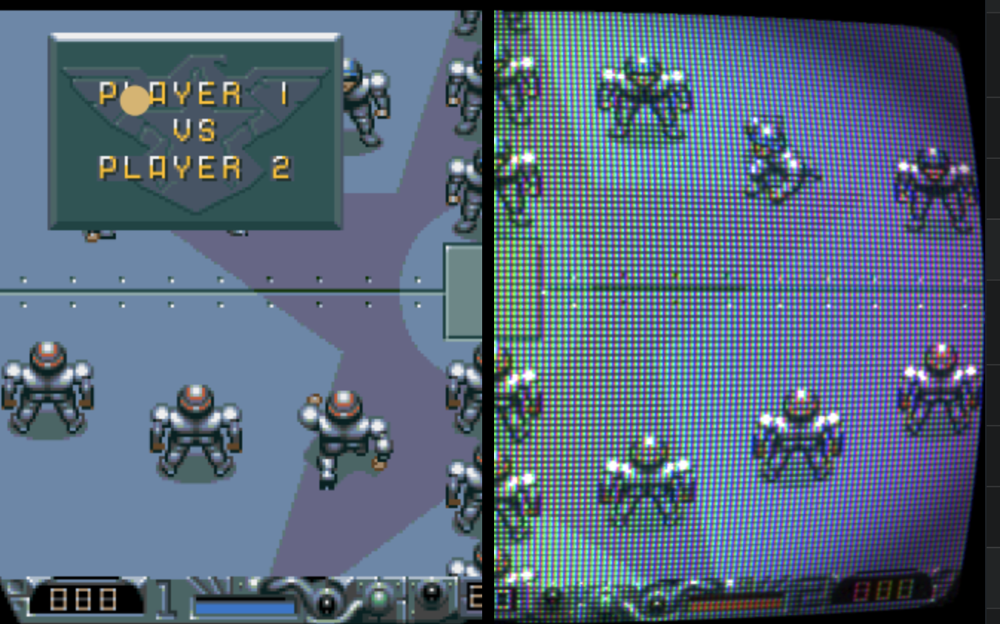

Slotmask gives this emergent characteristic of colourisation around areas of high contrast:

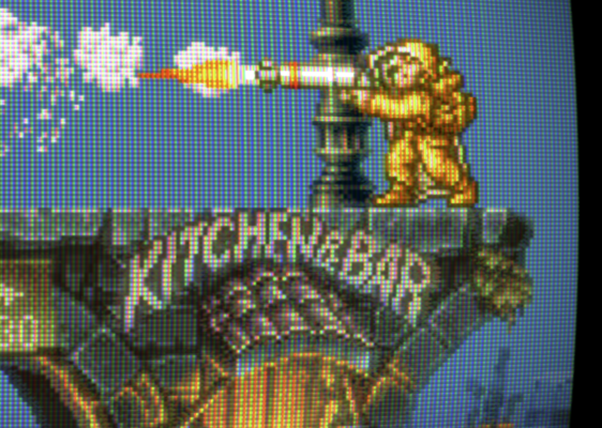

or in my Head over heels remake - note the primary colours emerging on the floor edge (unprocessed on the left):

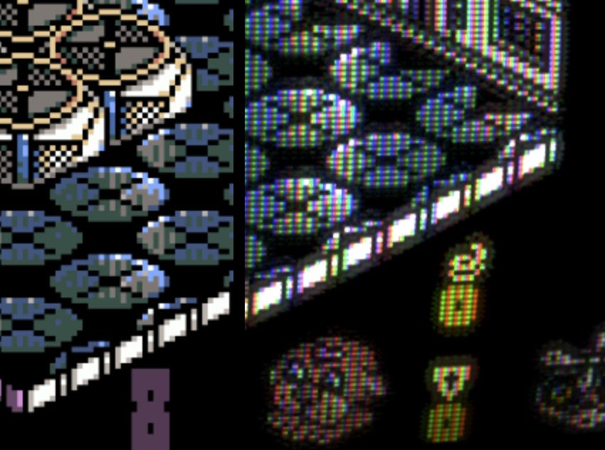

### Vignette, rounded corners, and curvature 

Three more shaders to control screen shape, curve, and darkening in the corners. Left is normal, right is curved etc:

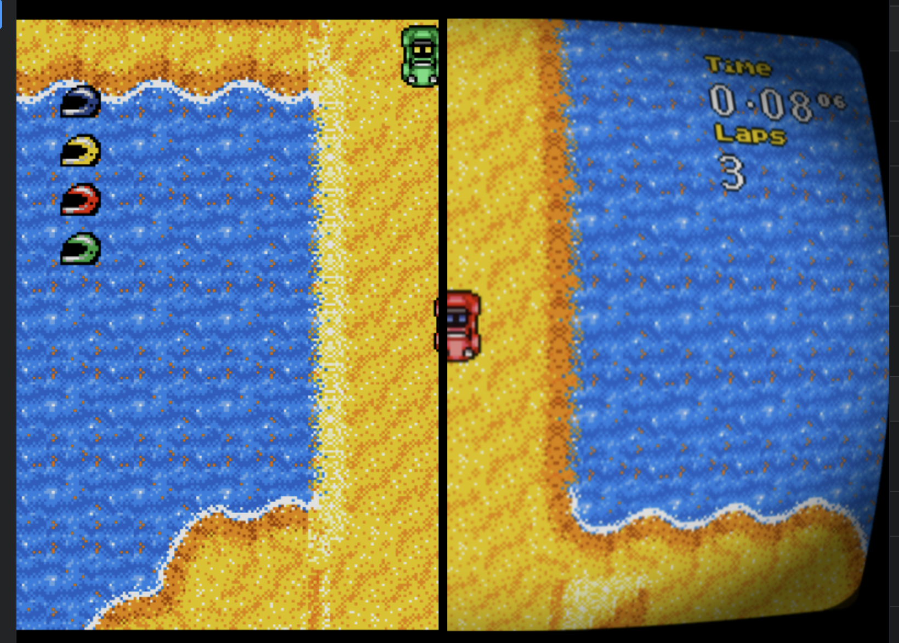

## Using with pixi.js

Apply filters directly to any DisplayObject:

```ts
import {
  ScanlinesFilter,
  PhosphorMaskFilter,
  BloomFilter,
  createCrtFilterPipeline
} from '@blockstacking/jims-shaders';
import { Application, Container } from 'pixi.js';

const app = new Application();
const container = new Container();

// Option 1: Use individual filters
container.filters = [
  new ScanlinesFilter({ pixelHeight: 4, gapBrightness: 0.3 }),
  new PhosphorMaskFilter({ pixelWidth: 4.5, maskBrightness: 0.3 }),
  new BloomFilter({ intensity: 0.5, radius: 6.5 })
];

// Option 2: Use the convenient pipeline creator
container.filters = createCrtFilterPipeline({
  scanlines: { pixelHeight: 4, gapBrightness: 0.3 },
  phosphorMask: { pixelWidth: 4.5, maskBrightness: 0.3 },
  bloom: { intensity: 0.5, radius: 6.5 },
  curvature: { curvatureX: 0.35, curvatureY: 0.35 }
});
```

## Using with @pixi.js/react

Use filters with React components in @pixi/react:

```tsx
import { Stage, Container, Sprite } from '@pixi/react';
import { useMemo } from 'react';
import {
  ScanlinesFilter,
  PhosphorMaskFilter,
  createCrtFilterPipeline
} from '@blockstacking/jims-shaders';

function CRTDisplay() {
  const filters = useMemo(() => [
    new ScanlinesFilter({ pixelHeight: 4, gapBrightness: 0.3 }),
    new PhosphorMaskFilter({ pixelWidth: 4.5, maskBrightness: 0.3 })
  ], []);

  return (
    <Stage width={800} height={600}>
      <Container filters={filters}>
        <Sprite image="game.png" />
      </Container>
    </Stage>
  );
}

// Or use the pipeline for convenience
function CRTDisplayWithPipeline() {
  const filters = useMemo(() =>
    createCrtFilterPipeline({
      scanlines: { pixelHeight: 4, gapBrightness: 0.3 },
      phosphorMask: { pixelWidth: 4.5, maskBrightness: 0.3 },
      bloom: { intensity: 0.5, radius: 6.5 }
    }), []
  );

  return (
    <Stage width={800} height={600}>
      <Container filters={filters}>
        <Sprite image="game.png" />
      </Container>
    </Stage>
  );
}
```

## Using outside of pixi.js

The GLSL fragment shaders are importable directly like this:

```ts
import {
  phosphorMaskFragmentSource,
  replacePlaceholders
} from '@blockstacking/jims-shaders';

// Some shaders have placeholders like {{NUM_SAMPLES}} that need replacing
const processedShader = replacePlaceholders(phosphorMaskFragmentSource, {
  NUM_SAMPLES: 4  // Set antialiasing samples
});

// The processed shader is ready for WebGL
const shader = gl.createShader(gl.FRAGMENT_SHADER);
gl.shaderSource(shader, processedShader);
gl.compileShader(shader);
```

Note that you will have to provide the `uInputClamp`, the same way as pixi.js does - this describes the "active" part of the texture using xyzw for xywh. See pixi docs for examples.

## Development

```bash
# Install dependencies
pnpm install

# Run Storybook for development
pnpm storybook

# Build library
pnpm build

# Build and preview Storybook
pnpm build-storybook
pnpm preview-storybook
```

## License

**CC BY-NC-ND 4.0** (Creative Commons Attribution-NonCommercial-NoDerivatives 4.0 International) - see [LICENSE](./LICENSE) file for details.

This means you can share and use these shaders for non-commercial purposes with attribution, but cannot modify or use them commercially under this license.

**For commercial use or to create derivative works**, please contact jim@blockstack.ing for alternative licensing terms.